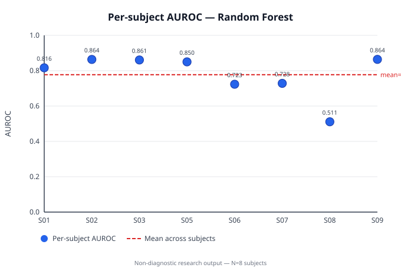

# Daphnet Trunk-Sensor LOSO Benchmark

> **Primary result:** This report supersedes the 3-fold grouped estimate in
> [daphnet_real_data_report.md](daphnet_real_data_report.md) as the primary
> validation result for the Daphnet trunk benchmark.

> **Research-use boundary:** This is a preliminary, research-only
> reproducibility report. It is non-diagnostic, has not been clinically
> validated, and is not evidence of clinical readiness, safety, or utility for
> decisions about an individual.

## Dataset Provenance and Citation

The local benchmark used the Daphnet Freezing of Gait dataset after manual
download. Raw recordings, the source ZIP, the converted CSV, and the benchmark
JSON are not committed to this repository. The publishable artifact retained
here contains only aggregate metrics.

The Daphnet README requires citation of:

Marc Bächlin, Meir Plotnik, Daniel Roggen, Inbal Maidan, Jeffrey M. Hausdorff,
Nir Giladi, and Gerhard Tröster, *Wearable Assistant for Parkinson's Disease
Patients With the Freezing of Gait Symptom*. IEEE Transactions on Information
Technology in Biomedicine, 14(2), March 2010, pages 436–446.

Users must review and comply with the dataset's current terms, documentation,
and citation requirements before obtaining or using it.

## Why LOSO instead of GroupKFold?

Leave-One-Subject-Out (LOSO) validation holds out exactly one subject per fold,
giving a per-subject breakdown of model performance and an honest simulation of
generalisation to a new individual. The previous 3-fold grouped estimate pooled
3–4 subjects into each test fold, masking subject-to-subject variance and making
the aggregate AUROC harder to interpret.

LOSO produces 10 folds for 10 subjects, allowing mean ± standard deviation to
be reported across folds.

> **Caveat:** N=10 subjects; standard deviation is reported but should not be
> read as a stable population estimate. Inter-subject variance in a cohort of
> this size reflects both model sensitivity and the heterogeneity of individual
> freezing patterns.

## Exact Local Benchmark Configuration

| Setting | Value |
| --- | ---: |
| Sensor | trunk/hip |
| Sampling rate | 64.0 Hz |
| Window size | 128 samples |
| Approximate window duration | 2.0 seconds |
| Overlap fraction | 0.5 |
| Validation | Leave-One-Subject-Out (LOSO) |
| Subjects | 10 |
| Total complete windows | 17,815 |
| Feature count | 25 |
| Random seed | 42 |

## Per-Subject Metrics — Random Forest

> **Note on S04 and S10:** These subjects had zero annotated freeze windows
> after windowing (n_positive = 0). AUROC is undefined with only one class
> present; they are excluded from Mean ± SD.

| Subject | n_windows | n_positive | AUROC | AUPRC | Brier | ECE |
| --- | ---: | ---: | ---: | ---: | ---: | ---: |
| S01 | 1,899 | 101 | 0.8164 | 0.3676 | 0.0494 | 0.0708 |
| S02 | 1,414 | 181 | 0.8635 | 0.5531 | 0.0821 | 0.0204 |
| S03 | 2,009 | 286 | 0.8607 | 0.4357 | 0.0941 | 0.0308 |
| S04 | 2,069 | 0 | N/A | — | — | — |
| S05 | 2,089 | 476 | 0.8500 | 0.5675 | 0.1592 | 0.1406 |
| S06 | 1,989 | 133 | 0.7234 | 0.1519 | 0.0612 | 0.0192 |
| S07 | 1,609 | 83 | 0.7282 | 0.1253 | 0.1021 | 0.1681 |
| S08 | 769 | 204 | 0.5111 | 0.2730 | 0.2255 | 0.1481 |
| S09 | 1,739 | 267 | 0.8641 | 0.5851 | 0.1178 | 0.1129 |
| S10 | 2,229 | 0 | N/A | — | — | — |
| **Mean ± SD** | | | **0.7772 ± 0.1224** | **0.3824 ± 0.1847** | **0.1114 ± 0.0573** | **0.0889 ± 0.0613** |

_Mean ± SD over 8 evaluable folds; S04 and S10 excluded (zero positive windows)._

## Per-Subject Metrics — Logistic Regression

> **Note on S04 and S10:** Same as above — excluded from Mean ± SD.

| Subject | n_windows | n_positive | AUROC | AUPRC | Brier | ECE |
| --- | ---: | ---: | ---: | ---: | ---: | ---: |
| S01 | 1,899 | 101 | 0.7584 | 0.1691 | 0.2502 | 0.3785 |
| S02 | 1,414 | 181 | 0.7674 | 0.2750 | 0.2190 | 0.2959 |
| S03 | 2,009 | 286 | 0.8361 | 0.4116 | 0.2181 | 0.2988 |
| S04 | 2,069 | 0 | N/A | — | — | — |
| S05 | 2,089 | 476 | 0.8322 | 0.5032 | 0.1949 | 0.2011 |
| S06 | 1,989 | 133 | 0.5060 | 0.0621 | 0.2652 | 0.4244 |
| S07 | 1,609 | 83 | 0.7881 | 0.2232 | 0.2407 | 0.4401 |
| S08 | 769 | 204 | 0.4282 | 0.2299 | 0.2293 | 0.1378 |
| S09 | 1,739 | 267 | 0.9419 | 0.7118 | 0.0820 | 0.0826 |
| S10 | 2,229 | 0 | N/A | — | — | — |
| **Mean ± SD** | | | **0.7323 ± 0.1746** | **0.3232 ± 0.2085** | **0.2124 ± 0.0569** | **0.2824 ± 0.1321** |

_Mean ± SD over 8 evaluable folds; S04 and S10 excluded (zero positive windows)._

## Per-Subject AUROC Figure



The figure shows one dot per subject on the y-axis (AUROC) with a horizontal
dashed line at the cross-subject mean. It contains only aggregate discrimination
metrics and no participant-level or raw sensor information.

> **Note:** The SVG above is a generated artifact produced by
> `scripts/make_loso_figure.py` and is not committed (covered by `.gitignore`).
> Run the reproduction workflow below to regenerate it.

## Interpretation

The LOSO breakdown reveals substantial inter-subject variance (RF AUROC range:
0.5111–0.8641 across the 8 evaluable folds). Subject S08 shows the lowest
discrimination (AUROC 0.5111, near-chance), while S09 achieves the highest
(0.8641). The RF mean AUROC of 0.7772 ± 0.1224 is broadly consistent with the
prior 3-fold grouped estimate (0.7795 pooled) but the per-subject spread —
SD = 0.12 across only 8 subjects — cautions against treating the mean as a
stable population estimate.

Two subjects (S04 and S10) had zero annotated freeze windows after windowing
with the chosen configuration and are excluded from Mean ± SD. This likely
reflects sparsity in annotation rather than absence of FoG events.

Logistic regression achieves a mean AUROC of 0.7323 ± 0.1746, slightly below RF
but with larger variance and substantially worse calibration (ECE 0.2824 vs.
0.0889 for RF). The difference in Brier score (LR: 0.2124, RF: 0.1114) further
confirms that RF produces better-calibrated probability estimates for this task.

## Limitations

- Only the trunk/hip sensor was used; ankle, thigh, and multi-sensor
  combinations were not evaluated.
- Features were simple handcrafted window summaries rather than a comprehensive
  signal representation.
- No nested hyperparameter tuning was performed.
- LOSO standard deviation across N=10 subjects is descriptive only and should
  not be extrapolated to population-level variance.
- No external dataset or prospective validation was performed.
- No subgroup, fairness, device-shift, medication-state, or protocol analysis.
- Window labels can obscure short transitions; overlapping windows are
  correlated within subjects.
- Reference annotations may not reflect unscripted daily living conditions.
- No clinical-readiness claim is made.

## Local Reproduction Workflow

After manually obtaining Daphnet, keep the archive under the ignored `data/raw/`
path and run:

```bash
python scripts/prepare_daphnet.py \
  --input data/raw/daphnet.zip \
  --output data/processed/daphnet_trunk.csv \
  --sensor trunk

python scripts/run_baselines.py \
  --input data/processed/daphnet_trunk.csv \
  --output results/daphnet_trunk_loso_benchmark.json \
  --sampling-rate 64 \
  --window-size 128 \
  --overlap 0.5 \
  --validation loso \
  --thresholds 0.3 0.5 0.7 \
  --calibration-bins 5 \
  --random-seed 42

python scripts/make_loso_figure.py \
  --input results/daphnet_trunk_loso_benchmark.json \
  --output docs/figures/daphnet_loso_benchmark.svg
```

After running, fill in the per-subject tables above from the `per_fold` arrays
in `results/daphnet_trunk_loso_benchmark.json`. The `aggregate` section in the
JSON contains `auroc_mean`, `auroc_std`, etc. for the Mean ± SD row.

The raw archive, converted CSV, benchmark JSON, and generated
`docs/figures/daphnet_loso_benchmark.svg` are ignored and must remain
uncommitted.
