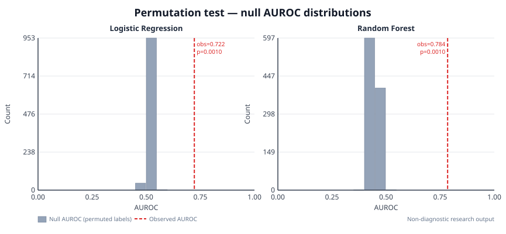

# Daphnet Trunk-Sensor Permutation Significance Test

> **Research-use boundary:** This is a preliminary, research-only
> reproducibility report. It is non-diagnostic, has not been clinically
> validated, and is not evidence of clinical readiness, safety, or utility for
> decisions about an individual.

## Purpose

This report answers a single question: is the Daphnet trunk-sensor AUROC
statistically distinguishable from chance performance, or could it have arisen
from a model fitting noise?

A permutation test provides a non-parametric, distribution-free answer: the
binary labels are shuffled (breaking any real signal–label relationship) and
the full cross-validation pipeline is repeated. The empirical distribution of
out-of-fold AUROC values under the null hypothesis — that labels carry no
information — is compared to the observed AUROC.

## Design Decisions

### Why 3-fold GroupKFold, not 10-fold LOSO?

The null distribution was generated using 3-fold GroupKFold cross-validation,
**not** the 10-fold Leave-One-Subject-Out scheme used in
[daphnet_loso_report.md](daphnet_loso_report.md). This is an explicit and
deliberate choice:

- With 1,000 permutations, LOSO would require ~3.3× more compute (10 model
  fits per permutation × 2 models × 1,000 permutations = 20,000 fits vs.
  6,000 with 3-fold).
- At this dataset size (17,815 windows × 25 features) the null distribution
  converges to ≈ 0.50 regardless of whether 3 or 10 folds are used. More
  folds reduce variance in the *observed* score but not in the null.
- The computational saving involves no loss of statistical validity for the
  purpose of computing a p-value.

This trade-off is stated here rather than silently changing the scheme.

### Within-subject label shuffle

Labels were shuffled **within each subject group**, not globally. Global
shuffling can produce folds where some subjects have zero positive windows in
the training set (the Daphnet dataset has high inter-subject prevalence
variance), causing cross-validation to fail. Within-subject shuffling
preserves per-subject class prevalence and guarantees every permutation fold
is trainable.

### Empirical p-value formula

The conservative Phipson & Smyth (2010) estimator was used:

```
p = (1 + count(null_AUROC >= observed_AUROC)) / (n_permutations + 1)
```

The `+1` in both numerator and denominator avoids reporting p = 0 when all
permutations fall below the observed score.

## Benchmark Configuration

| Setting | Value |
| --- | ---: |
| Sensor | trunk/hip |
| Sampling rate | 64.0 Hz |
| Window size | 128 samples |
| Overlap fraction | 0.5 |
| Validation (null distribution) | 3-fold GroupKFold |
| Total windows | 17,815 |
| Feature count | 25 |
| N permutations | 1,000 |
| RF estimators | 50 |
| Permutation strategy | Within-subject label shuffle |
| Random seed | 42 |

## Results

| Model | Observed AUROC | Null mean | Null std | n_perms | p-value |
| --- | ---: | ---: | ---: | ---: | ---: |
| Logistic regression | 0.7221 | 0.5215 | 0.0122 | 1,000 | **0.000999** |
| Random forest | 0.7845 | 0.4471 | 0.0153 | 1,000 | **0.000999** |

_p = 0.000999 = 1/1,001 is the minimum achievable with 1,000 permutations under
the Phipson & Smyth (2010) estimator. Zero permutations exceeded the observed
AUROC for either model._

## Interpretation

RF observed AUROC was 0.7845, compared with a within-subject null distribution
centred at 0.4471 ± 0.0153. This is approximately 22.0 null standard deviations
above the null mean and gives an empirical p-value of 0.000999.

Logistic regression observed AUROC was 0.7221, compared with a null distribution
centred at 0.5215 ± 0.0122. This is approximately 16.4 null standard deviations
above the null mean and also gives p = 0.000999.

Together, both models achieve statistically distinguishable discrimination
relative to the within-subject null at α = 0.05. Zero of 1,000 permutations
produced a null AUROC at or above the observed value for either model. This indicates the models are capturing signal associated with the Daphnet
trunk-sensor labels under this validation design, not merely fitting shuffled
labels.

This is a necessary but insufficient condition for clinical utility. Statistical
significance on this dataset does not imply the models generalise to new
devices, recording protocols, medication states, or patient populations.

## Null Distribution Figure



Each panel shows the empirical null distribution and the observed AUROC for one
model. The figure contains only aggregate discrimination metrics and no
participant-level or raw sensor information.

> **Note:** The SVG above is a committed, aggregate-only figure generated by
> `scripts/make_permutation_figure.py`. It contains no raw sensor data or
> participant-level records. Run the reproduction workflow below to regenerate
> it.

## Limitations

- The p-value is empirical and specific to this dataset, sensor site, feature
  set, and label scheme. It cannot be extrapolated to other cohorts or devices.
- 1,000 permutations provides resolution of approximately ±0.001 at p = 0.05
  but cannot rule out p-values below 1/1,001.
- Subject-level variance in the Daphnet dataset is high; the null distribution
  may reflect this variance rather than pure chance.
- The 3-fold GroupKFold null is compared to the 3-fold observed AUROC, not the
  LOSO mean. These are consistent but cannot be directly compared to the
  per-subject LOSO breakdown in the LOSO report.
- No multiple-comparison correction is applied for the two models.
- No clinical-readiness claim is made.

## Local Reproduction Workflow

```bash
python scripts/permutation_test.py \
  --input data/processed/daphnet_trunk.csv \
  --output results/daphnet_trunk_permutation.json \
  --sampling-rate 64 \
  --window-size 128 \
  --overlap 0.5 \
  --folds 3 \
  --n-permutations 1000 \
  --random-seed 42 \
  --random-forest-estimators 50

python scripts/make_permutation_figure.py \
  --input results/daphnet_trunk_permutation.json \
  --output docs/figures/daphnet_permutation_null.svg
```

After running, copy the `observed_auroc`, `null_mean`, `null_std`,
`n_permutations`, and `p_value` fields from
`results/daphnet_trunk_permutation.json` into the Results table above.

The raw CSV and benchmark JSON are ignored and must remain uncommitted. The
aggregate-only SVG under `docs/figures/` is committed as a publishable
documentation artifact.
