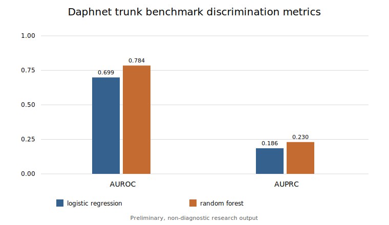

# Preliminary Daphnet Trunk-Sensor Benchmark

> **Research-use boundary:** This is a preliminary, research-only reproducibility
> report. It is non-diagnostic, has not been clinically validated, and is not evidence
> of clinical readiness, safety, or utility for decisions about an individual.

## Dataset Provenance and Citation

The local benchmark used the Daphnet Freezing of Gait dataset after manual download.
Raw recordings, the source ZIP, the converted CSV, and the benchmark JSON are not
committed to this repository. The publishable artifact retained here contains only
aggregate metrics.

The Daphnet README requires citation of:

Marc Bächlin, Meir Plotnik, Daniel Roggen, Inbal Maidan, Jeffrey M. Hausdorff,
Nir Giladi, and Gerhard Tröster, *Wearable Assistant for Parkinson's Disease Patients
With the Freezing of Gait Symptom*. IEEE Transactions on Information Technology in
Biomedicine, 14(2), March 2010, pages 436-446.

Users must review and comply with the dataset's current terms, documentation, and
citation requirements before obtaining or using it.

## Conversion and Label Mapping

The source recordings contain 11 whitespace-separated columns: time, three ankle axes,
three thigh axes, three trunk axes, and annotation. This benchmark selected the
trunk/hip triplet and mapped it into the project schema as follows:

| Daphnet column | Project column |
| --- | --- |
| `trunk_forward` | `acc_x` |
| `trunk_vertical` | `acc_y` |
| `trunk_lateral` | `acc_z` |

Annotation `0` rows were excluded because they are outside the experiment. Annotation
`1` (experiment, no freeze) was mapped to label `0`; annotation `2` (freeze) was mapped
to label `1`. Subject IDs were derived from recording names, for example `S01` from
`S01R01.txt`.

## Exact Local Benchmark Configuration

| Setting | Value |
| --- | ---: |
| Sensor | trunk/hip |
| Sampling rate | 64.0 Hz |
| Window size | 128 samples |
| Approximate window duration | 2.0 seconds |
| Overlap fraction | 0.5 |
| Validation | 3 subject-aware folds |
| Subjects | 10 |
| Samples after removing annotation 0 | 1,140,835 |
| Complete windows | 17,815 |
| Feature count | 25 |

The validation design kept subject IDs disjoint between training and test data within
each fold. The aggregate threshold tables contain 16,084 negative windows and 1,731
positive windows, giving an observed positive-window prevalence of approximately 9.72%.
That imbalance is why AUPRC is emphasized alongside AUROC.

## Aggregate Metrics

| Model | AUROC | AUPRC | Brier score | ECE |
| --- | ---: | ---: | ---: | ---: |
| Logistic regression | 0.6985 | 0.1856 | 0.2195 | 0.3280 |
| Random forest | 0.7845 | 0.2304 | 0.0951 | 0.0627 |

The Brier score and ECE summarize probability calibration on this evaluation; they do
not turn model scores into validated individual risk estimates. ECE also depends on the
chosen bins and sample distribution.

## Threshold Summaries

### Logistic regression

| Threshold | Precision | Sensitivity | Specificity | F1 | TN | FP | FN | TP |
| ---: | ---: | ---: | ---: | ---: | ---: | ---: | ---: | ---: |
| 0.3 | 0.1272 | 0.9601 | 0.2909 | 0.2246 | 4,679 | 11,405 | 69 | 1,662 |
| 0.5 | 0.1514 | 0.6268 | 0.6219 | 0.2439 | 10,003 | 6,081 | 646 | 1,085 |
| 0.7 | 0.2243 | 0.2461 | 0.9084 | 0.2347 | 14,611 | 1,473 | 1,305 | 426 |

### Random forest

| Threshold | Precision | Sensitivity | Specificity | F1 | TN | FP | FN | TP |
| ---: | ---: | ---: | ---: | ---: | ---: | ---: | ---: | ---: |
| 0.3 | 0.2375 | 0.5505 | 0.8098 | 0.3319 | 13,025 | 3,059 | 778 | 953 |
| 0.5 | 0.2764 | 0.2317 | 0.9347 | 0.2520 | 15,034 | 1,050 | 1,330 | 401 |
| 0.7 | 0.2650 | 0.0485 | 0.9855 | 0.0820 | 15,851 | 233 | 1,647 | 84 |

These thresholds show material sensitivity-specificity tradeoffs. They were included for
descriptive analysis and are not recommended clinical operating points. Threshold
selection for a future intended use would require an independently justified procedure
that does not optimize against final test outcomes.

## Aggregate Figure



The figure contains only aggregate discrimination metrics and no participant-level or
raw sensor information.

## Interpretation

The random forest outperformed logistic regression on this preliminary trunk-only
benchmark across AUROC and AUPRC, and it produced lower Brier score and ECE. However,
AUPRC remained modest relative to the difficulty and imbalance of the task. These
results are a reproducibility benchmark for two simple models, not clinical evidence.

They do not establish diagnostic validity, reliable real-time FoG detection, patient
benefit, safety, generalization to other cohorts or devices, or suitability for clinical
decision-making.

## Limitations

- Only the trunk/hip sensor was used; ankle, thigh, and multi-sensor combinations were
  not evaluated.
- Features were simple handcrafted window summaries rather than a comprehensive signal
  representation.
- No nested hyperparameter tuning was performed.
- No confidence intervals or subject-level uncertainty estimates were computed.
- There was no external dataset or prospective validation.
- No subgroup, fairness, device-shift, medication-state, or protocol analysis was
  performed.
- Window labels can obscure short transitions, and overlapping windows are correlated
  within subjects.
- Reference annotations and experimental recordings may not reflect unscripted daily
  living conditions.
- No clinical-readiness claim is made.

## Local Reproduction Workflow

After manually obtaining Daphnet, keep the archive or extracted directory under the
ignored `data/raw/` path and run:

```bash
python scripts/prepare_daphnet.py \
  --input data/raw/daphnet.zip \
  --output data/processed/daphnet_trunk.csv \
  --sensor trunk

python scripts/run_baselines.py \
  --input data/processed/daphnet_trunk.csv \
  --output results/daphnet_trunk_benchmark.json \
  --sampling-rate 64 \
  --window-size 128 \
  --overlap 0.5 \
  --folds 3 \
  --thresholds 0.3 0.5 0.7
```

The raw archive, extracted recordings, converted CSV, benchmark JSON, and generated
`results/figures/` outputs are ignored and must remain uncommitted.
